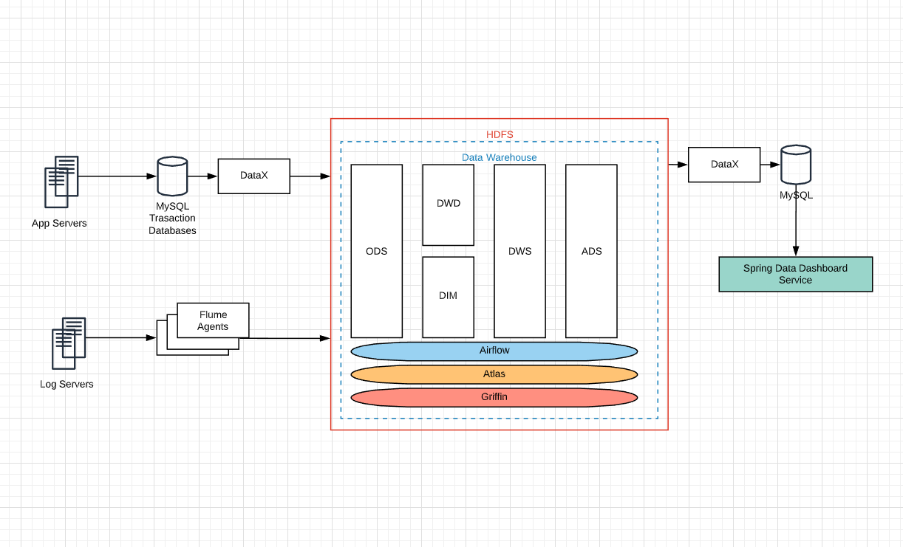

# E-Commerce Data Warehouse + Data Dashboard

- this is TODO

## Related Stacks and Frameworks

### Data Warehouse

- Data collecting & synchronization: **Flume**, **DataX**
- Distributed Storage: **HDFS**
- Compute: **Hive**(engine used with **Tez**)
- Task automation: **Airflow**
- Metadata management: **Atlas**

### Data Dashboard

- Framework: **Spring MVC**
- Database & query: **MyBatis** with **MySQL**
- Visualization: **Echarts.js**

