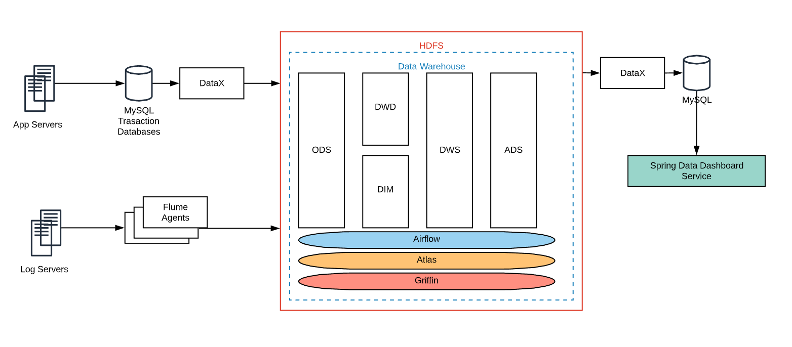

# E-Commerce Data Warehouse + Data Dashboard

- Credits to makotoBot98 and Yunjia Wang for contributing to this project

## Directory Structure

- `datawarehouse` contains the the documentation and codes for related data warehouse pipelines, modeling methods, scripts including 
  - **flume configuration, custom interceptor scripts** for importing data between log servers log files and **HDFS**
  - **airflow scripts** for task scheduling
  - **SQL scripts** executed using **Hive**  to build the **ods**, **dwd**, **dim**, **dws**, **ads** layers of the data warehouse 
  - **DataX scripts** for importing data between **HDFS** and **MySQL** database server
  - some **bash scripts** needed to make the pipelines to work
- `visualization` contains the java source code for data dashboard service using **SpringMVC, MyBatis, and Echarts**

## Logical Architecture

## Related Stacks and Frameworks

### Data Warehouse

- Data collecting & synchronization: **Flume**, **DataX**
- Distributed Storage: **HDFS**
- Compute: **Hive**(engine used with **Tez**)
- Task automation: **Airflow**
- Metadata management: **Atlas**

### Data Dashboard

- Framework: **Spring MVC**
- Database & query: **MyBatis** with **MySQL**
- Visualization: **Echarts.js**

