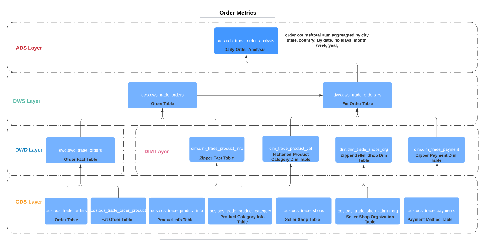
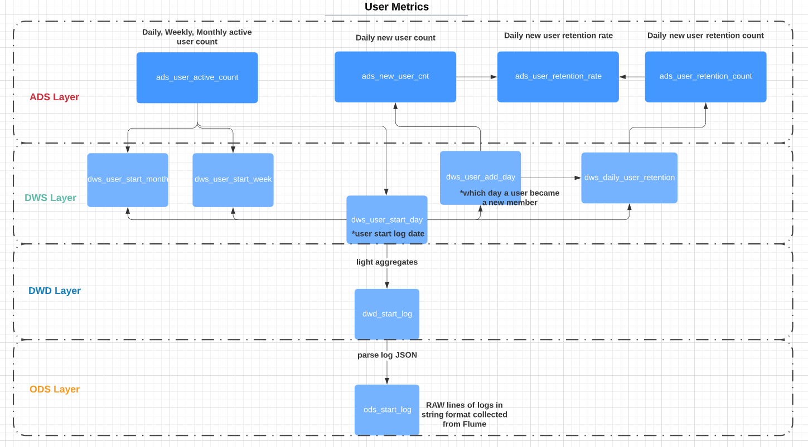
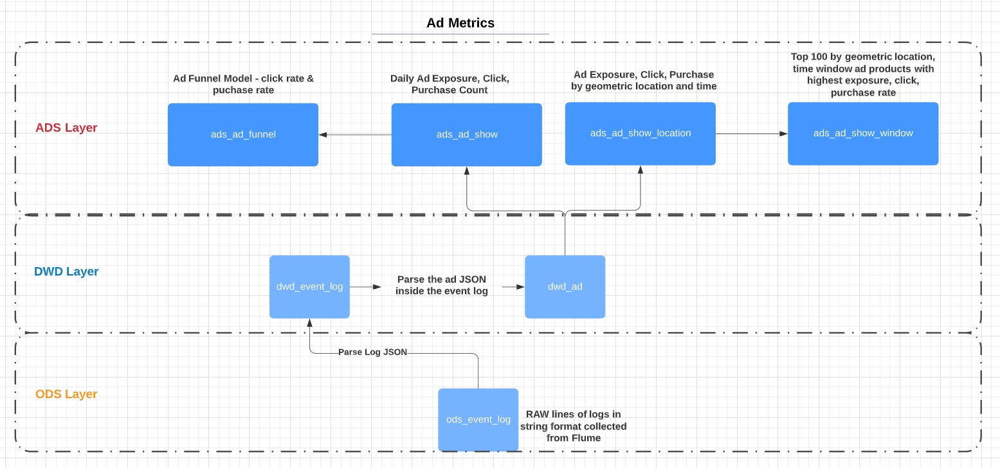

# Table of content

- Data Warehouse Modeling documentation(Hive, HDFS)
- Data Sync Documentation(Flume, DataX)

# Data Warehouse Modeling

Data Warehouse Modeling documentation is organized into type of matrices that we computed, there are mainly three categories of matrices: **User Category**, **Ad Category**, and **Order/Trade Category**

## Order/Trade Category



## User Category



## Ad Category




# Data Import

## Sync Start Log and Event Log to HDFS - Flume

there two types of logs: **app device start log** and **event log** 

- App device start log is collected when user open the E-commerce application
- Event log is triggered when an add is clicked/exposed, or user purchase/add-to-favorite/product comment ... actions.

Logs will be batch sync from log servers to the **HDFS** through **Flume agents**

### Flume Agent Configuration

- Here we use multiple `Taildir` **Flume sources** to track the log directories: start log directory and event log directory
- We use **HDFS sink** to batch sync the logs to a timestamped HDFS location
- We use memory channel for faster log sync performance, but file channel is preferred for fault tolerance

- notice here we defined a **custom Flume Interceptor** to extract the log event's time in order to send the event to the right HDFS location

  ```bash
  # adding custom flume interceptor to extract the log timestamp
  a1.sources.r1.interceptors.i1.type =
  com.ldw.flume.interceptor.LogTimeInterceptor$Builder
  ```


## Sync Transactional Data into HDFS - DataX

- TODO

